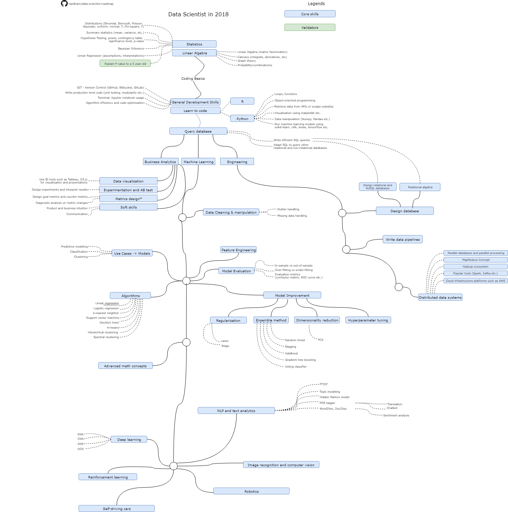

# Data Scientist Roadmap
Below you can find a chart demonstrating the paths that you can take and the milestones that you would want to achieve in order to become a data scientist. We spoke to senior data scientists and data science managers from various top tech companies in the Silicon Valley, and consolidated learnings from these conversations and data science Meetups in the Bay Area. We hope this can serve as a guide to everyone interested in breaking into data science, especially people who do not live in close proximity to any tech hubs and don’t have a strong personal network in data engineering.

We are continuing to add recommended resources, example practice projects and additional tips to expand the roadmap. Contributions are welcome and highly appreciated.

Depending on your background, you may already possess certain skills on the roadmap so skip those modules to craft your own path. If you have succeeded in making the transition to data science, we would love to hear from you and share your personal path with many others.

<code> If you are having difficulties to commit through this entire roadmap yourself. I will suggest finding someone like minded and have similar goals to start the arduous task of learning together. Heading over to meetups is one way to network with people who are looking to learn. We started a community to help connect people with similar learning goals. We plan to make it forever free for users. If you are interested, head over to https://www.boringppl.com/ </code>

## Disclaimer
The purpose of this roadmap is to give you an overview of the core skills needed in data science. These are views help by individuals we have spoken to and do not represent any companies’ opinion. Data science roles vary from one company to another, and from one role to another. If you are interested in a specific data engineering role, please invest time to research on the specific requirements and double down efforts on the relevant branches on the chart. If anything is missing, send a PR to update the chart. If you found any insights that helped you in your journey, the community will greatly benefit from your contribution.

## Roadmap

## Resources
* Overview of data science - after reading them you will find this roadmap makes a lot of sense
    * [ Advice For New And Junior Data Scientists - Hamel Husain (senior data scientist) |ODSC West 2017](https://www.youtube.com/watch?v=eDK1R6tpZlA)
    * [Key skill sets needed to be a data scientist](https://www.slideshare.net/ryanorban/how-to-become-a-data-scientist)
* Statistics:
    * [MITx 6.041 on (Edx)](https://courses.edx.org/courses/MITx/6.041x/1T2014/course/)
* Linear Algebra:
    * [Khan Academy's course](https://www.khanacademy.org/math/linear-algebra/vectors-and-spaces) has a good practical focus
* Learn to code
    * [MITx 6.001 Introduction to Python basics](https://www.edx.org/course/introduction-computer-science-mitx-6-00-1x-11)
    *
* Machine Learning
    * [Andrew Ng's Machine Learning class on Coursera](https://www.coursera.org/learn/machine-learning) or an old version can be found [here](https://github.com/zipfian/data-science-primer/tree/master/resources/coursera_ml)

## Successful Paths contributed by data scientists
